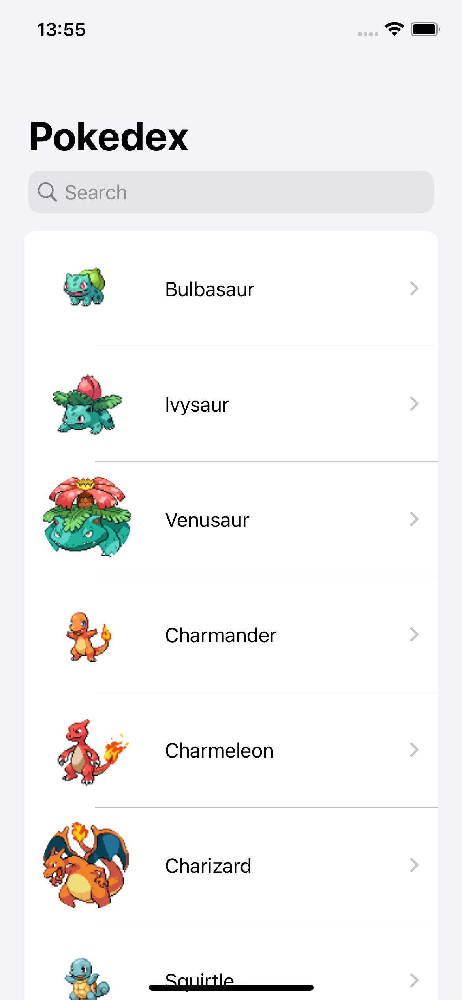

	<h1 align="center">
  		
	</h1>
	

	

    	
    	
  	

	<a href="#page_with_curl-about">About</a>&nbsp;&nbsp;&nbsp;|&nbsp;&nbsp;&nbsp;
	<a href="#hammer-technologies">Technologies</a>

	

## :page_with_curl: About
This repository contains a monorepo of the Pokedex app.

The Pokedex is an app which the user can view a list of Pokemons, search and view the details of a specific Pokemon. To get the Pokemons data it was used the [PokéAPI](https://pokeapi.co/).

## :hammer: Technologies

This project was developed with the following technologies:

- [Swift](https://docs.swift.org/swift-book/)

Made with 💜 by <a href="https://www.linkedin.com/in/gustavo-castilho-914a621b4/">Gustavo Castilho</a>
